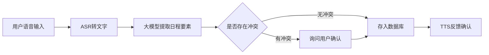
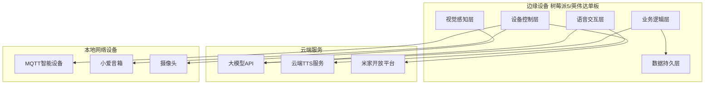
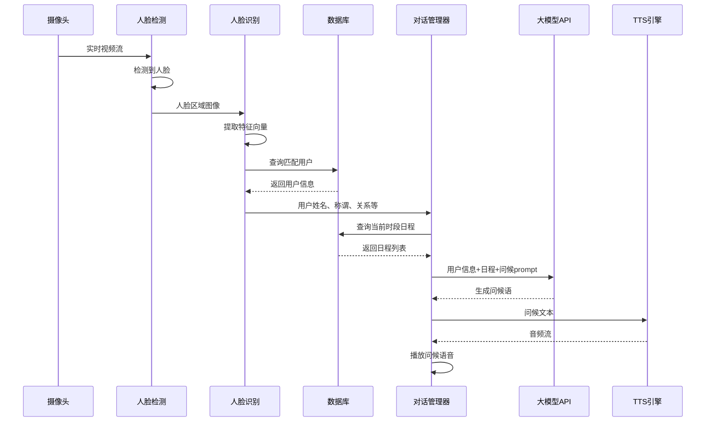
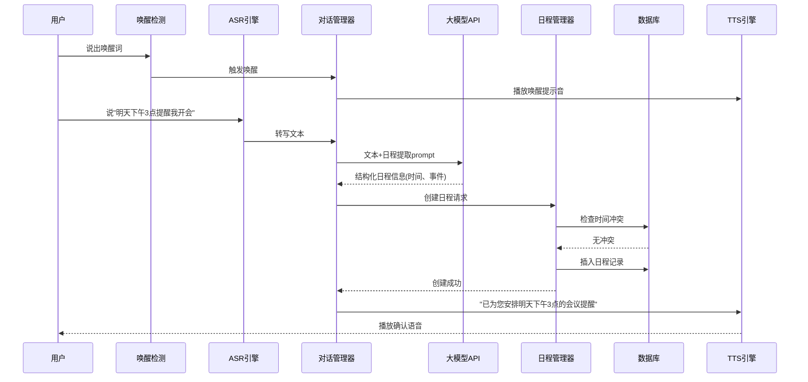
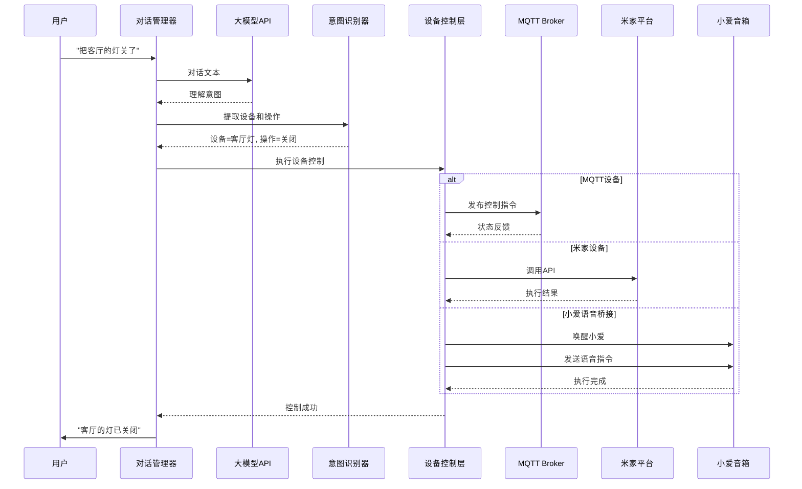
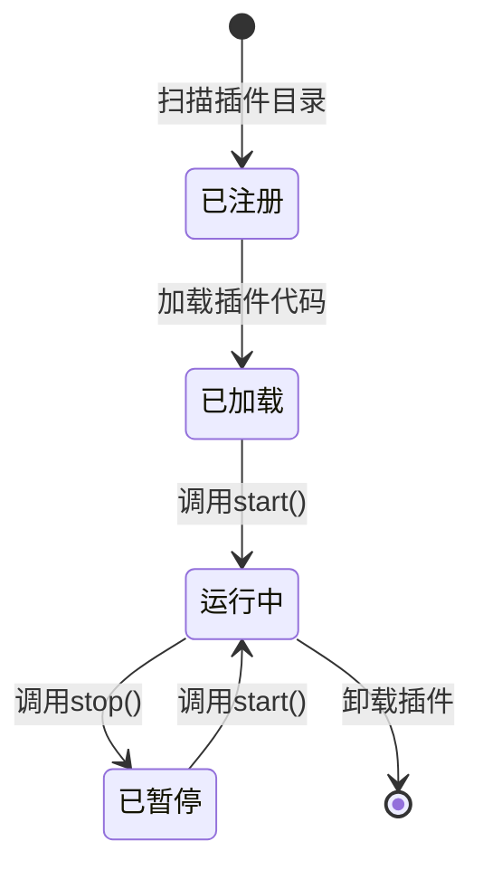

# 智能AI管家系统设计文档

## 一、系统概述

### 1.1 系统定位

智能AI管家是一个基于边缘计算的语音交互系统,部署在家庭环境中,通过云端大模型API实现自然语言理解,结合本地的记忆管理、人脸识别、日程管理、智能家居控制等能力,为用户提供有温度的智能助理服务。

### 1.2 核心设计原则

- **边缘优先**: 本地处理语音转写、人脸识别、设备控制等高频低延迟任务
- **云端增强**: 利用云端大模型API提供自然语言理解和对话生成能力
- **模块化架构**: 功能单元解耦,支持独立开发、测试和迭代
- **协议开放**: 预留标准接口(指令执行接口、MCP协议),支持未来扩展
- **资源优化**: 针对树莓派5/英伟达单板计算机的算力和功耗约束进行优化

## 二、功能需求分析

### 2.1 核心功能模块

#### 2.1.1 语音交互模块

**功能描述**: 实现自然流畅的语音对话,支持唤醒词激活和连续对话模式

**关键能力**:

- 语音唤醒检测(本地离线模型)
- 语音转文字(ASR,优先本地模型,云端备用)
- 文字转语音(TTS,云端合成,支持情感语调)
- VAD静音检测(本地实时处理)
- 连续对话状态管理(会话超时机制)

**性能约束**:

- 唤醒响应延迟 < 500ms
- ASR转写延迟 < 1s
- TTS合成+播放延迟 < 2s
- 端到端对话延迟 < 3s

#### 2.1.2 人脸识别与用户管理模块

**功能描述**: 通过摄像头实时识别来访者,结合用户档案库提供个性化问候

**关键能力**:

- 人脸检测(本地实时处理,MTCNN或RetinaFace轻量模型)
- 人脸识别(本地特征提取+匹配,FaceNet或ArcFace)
- 用户档案管理(姓名、称谓、与主人关系、职业等信息)
- 识别结果关联查询(从数据库获取用户详细信息)
- 陌生人检测与记录

**性能约束**:

- 人脸检测帧率 > 10 FPS
- 人脸识别准确率 > 95%
- 识别响应时间 < 500ms

#### 2.1.3 记忆管理模块

**功能描述**: 维护对话历史、用户偏好、事件记录,为大模型提供上下文

**关键能力**:

- 短期记忆(当前会话的对话历史)
- 长期记忆(用户偏好、历史事件、知识图谱)
- 记忆检索(基于语义相似度的向量检索)
- 记忆总结与归档(定期将短期记忆提炼为长期记忆)

**数据模型**:

| 字段名称 | 数据类型 | 说明 |
|---------|---------|------|
| 记忆ID | 唯一标识 | 主键 |
| 记忆类型 | 枚举 | 短期/长期/事实/事件 |
| 内容摘要 | 文本 | 记忆的文本描述 |
| 向量表示 | 浮点数组 | 用于语义检索的embedding |
| 关联用户 | 外键 | 关联的用户ID |
| 创建时间 | 时间戳 | 记忆产生时间 |
| 重要性评分 | 浮点数 | 用于记忆衰减和淘汰 |

#### 2.1.4 日程管理模块

**功能描述**: 通过语音创建、查询、提醒日程安排

**关键能力**:

- 日程信息提取(从自然语言中识别时间、事件、地点等要素)
- 日程冲突检测(同时段日程告警)
- 主动提醒触发(基于时间的触发器)
- 日程查询(按日期、事件类型等维度查询)

**业务流程**:

**数据模型**:

| 字段名称 | 数据类型 | 说明 |
|---------|---------|------|
| 日程ID | 唯一标识 | 主键 |
| 事件名称 | 文本 | 日程标题 |
| 开始时间 | 时间戳 | 日程开始时间 |
| 结束时间 | 时间戳 | 日程结束时间 |
| 地点 | 文本 | 事件发生地点 |
| 参与人 | 文本数组 | 相关人员 |
| 提醒时间 | 时间戳数组 | 提前提醒的时间点 |
| 状态 | 枚举 | 待办/进行中/已完成/已取消 |

#### 2.1.5 智能家居控制模块

**功能描述**: 集成MQTT协议、米家开放平台、小爱同学语音桥接,实现智能设备控制

**关键能力**:

**MQTT设备控制**:

- MQTT客户端连接管理
- 设备注册与发现
- 指令下发与状态订阅
- 自定义指令脚本扩展

**米家设备接入**:

- 米家开放平台OAuth认证
- 设备列表同步
- 设备状态查询
- 设备控制指令下发

**小爱同学语音桥接**:

- 意图识别(从对话中提取设备控制需求)
- 小爱音箱唤醒指令生成
- 指令执行反馈

**设备模型**:

| 字段名称 | 数据类型 | 说明 |
|---------|---------|------|
| 设备ID | 唯一标识 | 主键 |
| 设备名称 | 文本 | 用户定义的设备名称 |
| 设备类型 | 枚举 | 灯光/空调/窗帘/传感器等 |
| 接入协议 | 枚举 | MQTT/米家/小爱 |
| 连接配置 | JSON | 协议相关的连接参数 |
| 当前状态 | JSON | 设备的实时状态 |
| 支持指令 | 文本数组 | 设备支持的控制指令列表 |

#### 2.1.6 扩展能力模块

**功能描述**: 预留标准化接口,支持未来功能扩展

**MCP协议接口**:

- 定义标准的消息格式和通信协议
- 支持第三方模块注册和调用
- 提供统一的错误处理和日志记录

**指令执行接口**:

- 数据库操作指令封装
- 系统命令执行(受限白名单)
- 自定义脚本加载与运行

**扩展插件机制**:

- 插件生命周期管理(加载、启动、停止、卸载)
- 插件间依赖管理
- 插件配置热更新

## 三、系统架构设计

### 3.1 整体架构

### 3.2 分层架构设计

#### 3.2.1 语音交互层

**职责**: 处理语音输入输出,管理对话状态

**组件**:

- 唤醒词检测引擎(Porcupine或Snowboy)
- ASR引擎(优先Whisper Tiny本地部署,备用云端API)
- TTS引擎(云端服务,如Azure TTS或讯飞)
- VAD检测器(WebRTC VAD或silero-vad)
- 音频流管理器(麦克风采集、音频播放队列)

#### 3.2.2 视觉感知层

**职责**: 处理摄像头图像,识别人脸

**组件**:

- 视频流采集器(OpenCV或GStreamer)
- 人脸检测器(MTCNN轻量模型)
- 人脸识别器(InsightFace或FaceNet)
- 特征库管理器(人脸特征向量的存储与检索)

#### 3.2.3 业务逻辑层

**职责**: 实现核心业务功能,协调各模块

**组件**:

- 对话管理器(会话状态机、上下文管理)
- 记忆管理器(向量数据库、记忆检索)
- 日程管理器(日程CRUD、提醒调度)
- 意图识别器(从大模型响应中提取结构化意图)
- 任务编排器(多步骤任务的流程编排)

#### 3.2.4 设备控制层

**职责**: 与智能家居设备通信

**组件**:

- MQTT客户端(paho-mqtt)
- 米家SDK封装(米家开放平台HTTP API客户端)
- 小爱桥接器(通过局域网唤醒小爱音箱)
- 设备状态缓存(减少网络请求)

#### 3.2.5 数据持久层

**职责**: 数据存储与查询

**组件**:

- 关系数据库(SQLite,用于用户档案、日程、设备配置)
- 向量数据库(Qdrant或ChromaDB,用于记忆检索)
- 配置管理器(系统配置的读写)
- 数据备份模块(定期备份到云端或NAS)

### 3.3 核心流程设计

#### 3.3.1 人脸识别问候流程

#### 3.3.2 语音创建日程流程

#### 3.3.3 智能家居控制流程

## 四、技术选型方案

### 4.1 硬件平台选择

**推荐方案**: 英伟达Jetson Orin Nano(优先) 或 树莓派5(备选)

**对比分析**:

| 维度 | Jetson Orin Nano | 树莓派5 |
|-----|-----------------|--------|
| AI算力 | 40 TOPS(INT8),支持GPU加速 | CPU推理,性能受限 |
| 功耗 | 7-15W(可调节) | 5-8W |
| 人脸识别性能 | 实时处理(30+ FPS) | 需模型量化(10-15 FPS) |
| ASR本地部署 | 可运行Whisper Tiny实时转写 | 需要优化或云端辅助 |
| 价格 | 较高(约$499) | 较低(约$80) |
| 推荐场景 | 对响应速度要求高 | 成本敏感场景 |

**决策建议**: 优先选择Jetson Orin Nano,确保人脸识别和ASR的本地实时处理能力,满足1-3秒响应要求

### 4.2 开发语言与框架

**主开发语言**: Python 3.10+

**理由**:

- AI/ML生态成熟(PyTorch、TensorFlow、OpenCV)
- 丰富的第三方库(MQTT、数据库、Web框架)
- 快速原型开发,适合功能单元迭代验证
- 性能瓶颈可用C/C++或Rust扩展

**核心框架选型**:

| 功能域 | 框架/库 | 选型理由 |
|-------|--------|---------|
| Web管理后台 | FastAPI | 异步高性能,自动生成API文档,易于集成WebSocket |
| 数据库ORM | SQLAlchemy | 成熟稳定,支持SQLite和未来迁移到PostgreSQL |
| 向量数据库 | Qdrant | 纯Python,支持本地部署,检索性能优秀 |
| 人脸识别 | InsightFace | 精度高,提供预训练模型,支持ONNX加速 |
| 语音处理 | Whisper(ASR) + PyAudio(音频采集) | Whisper精度高,支持本地部署 |
| MQTT客户端 | paho-mqtt | 官方推荐,稳定可靠 |
| 任务调度 | APScheduler | 支持Cron表达式,适合日程提醒 |
| 配置管理 | Pydantic + YAML | 类型安全的配置验证 |

### 4.3 云端服务选型

**大模型API**: 推荐使用多厂商备份策略

| 厂商 | 模型 | 优势 | 备注 |
|-----|------|------|------|
| 阿里云 | 通义千问Qwen-Max | 中文理解强,价格适中 | 主力模型 |
| 智谱AI | GLM-4 | 长文本能力,函数调用 | 备用方案 |
| OpenAI | GPT-4o-mini | 综合能力强 | 海外访问或特殊需求 |

**TTS服务**: Azure TTS或讯飞语音

**选型理由**:

- 支持情感语调和多音色
- 低延迟(<2秒合成时间)
- 中文发音自然度高

**米家开放平台**: 米家IoT开放平台

**接入方式**:

- OAuth 2.0授权
- RESTful API调用
- 支持设备状态订阅(Webhook)

### 4.4 数据库架构

**关系数据库**: SQLite(初期) → PostgreSQL(扩展期)

**存储内容**:

- 用户档案表
- 日程表
- 设备配置表
- 系统配置表
- 对话历史表(短期保留)

**向量数据库**: Qdrant

**存储内容**:

- 长期记忆向量(用户偏好、历史事件)
- 人脸特征向量
- 知识库向量(如家庭设备说明书、常见问题)

### 4.5 模型部署方案

**人脸识别模型**:

- 检测模型: RetinaFace(ONNX格式)
- 识别模型: ArcFace ResNet50(ONNX格式)
- 部署方式: ONNX Runtime GPU加速(Jetson)或CPU优化(树莓派)

**语音唤醒模型**:

- Porcupine(商业免费层,支持自定义唤醒词)
- 部署方式: 本地CPU实时推理

**ASR模型**:

- Whisper Tiny或Base(取决于设备算力)
- 部署方式: Jetson上使用FasterWhisper优化,树莓派使用云端API(阿里云或讯飞)

**VAD模型**:

- Silero VAD v4
- 部署方式: 本地CPU实时推理

## 五、系统部署架构

### 5.1 边缘设备部署方案

**操作系统**: Ubuntu 22.04 LTS(Jetson)或Raspberry Pi OS(树莓派)

**容器化**: Docker + Docker Compose

**服务编排**:

| 服务名称 | 职责 | 端口 | 资源限制 |
|---------|------|------|---------|
| ai-assistant-core | 核心业务逻辑 | 8000(HTTP), 8001(WebSocket) | CPU 2核, 内存2GB |
| qdrant-vector-db | 向量数据库 | 6333 | CPU 1核, 内存1GB |
| mqtt-broker | MQTT消息代理 | 1883 | CPU 0.5核, 内存512MB |
| web-dashboard | Web管理界面 | 80 | CPU 0.5核, 内存512MB |
| camera-service | 摄像头服务 | 8002 | GPU共享, 内存1GB |

### 5.2 进程管理

**服务守护**: systemd或supervisor

**自动重启策略**:

- 异常退出自动重启
- 最大重启次数限制(防止频繁重启)
- 启动失败告警(通过语音或推送)

### 5.3 数据备份策略

**本地备份**:

- 每日定时备份数据库到本地存储
- 保留最近7天的增量备份

**云端备份**(可选):

- 每周加密上传到云存储(阿里云OSS或OneDrive)
- 用户隐私数据需加密处理

## 六、接口设计规范

### 6.1 MCP协议接口设计

**协议格式**: JSON-RPC 2.0

**消息结构**:

| 字段 | 类型 | 说明 |
|-----|------|------|
| jsonrpc | 字符串 | 固定值"2.0" |
| method | 字符串 | 方法名,如"device.control" |
| params | 对象 | 方法参数 |
| id | 字符串/数字 | 请求标识 |

**支持的方法类别**:

- device.control: 设备控制
- schedule.create: 创建日程
- memory.query: 查询记忆
- user.identify: 用户识别
- system.execute: 系统指令执行

### 6.2 指令执行接口

**接口形式**: RESTful API

**认证方式**: JWT Token

**指令类别**:

| 指令类型 | HTTP方法 | 路径 | 说明 |
|---------|---------|------|------|
| 数据库查询 | POST | /api/command/db/query | 执行受限的SELECT查询 |
| 数据库更新 | POST | /api/command/db/update | 执行INSERT/UPDATE/DELETE |
| MQTT发布 | POST | /api/command/mqtt/publish | 发布MQTT消息 |
| 系统脚本 | POST | /api/command/script/run | 运行预定义脚本(白名单) |

### 6.3 Web管理API

**框架**: FastAPI自动生成OpenAPI文档

**核心接口**:

| 功能 | 方法 | 路径 | 说明 |
|-----|------|------|------|
| 用户管理 | GET/POST/PUT/DELETE | /api/users | 用户档案CRUD |
| 日程管理 | GET/POST/PUT/DELETE | /api/schedules | 日程CRUD |
| 设备管理 | GET/POST/PUT/DELETE | /api/devices | 设备配置CRUD |
| 对话历史 | GET | /api/conversations | 查询对话记录 |
| 系统配置 | GET/PUT | /api/config | 系统参数配置 |
| 实时状态 | WebSocket | /ws/status | 推送系统实时状态 |

## 七、扩展能力设计

### 7.1 插件机制

**插件定义**:

- 每个插件是一个独立的Python包
- 实现标准的插件接口(init、start、stop、handle_event)
- 通过配置文件声明依赖和能力

**插件生命周期**:

**插件示例场景**:

- 天气查询插件(调用天气API)
- 新闻播报插件(爬取新闻网站)
- 音乐播放插件(集成QQ音乐或网易云)

### 7.2 自定义指令脚本

**脚本语言**: Python或Lua(轻量级)

**执行环境**: 沙箱隔离(RestrictedPython或容器)

**脚本能力**:

- 访问系统提供的API(设备控制、数据查询)
- 定时触发或事件触发
- 变量和状态存储

**示例场景**:

- 早晨自动播报天气和日程
- 离家模式(关闭所有灯光和空调)
- 睡眠模式(启动空气净化器、关闭灯光)

### 7.3 未来扩展方向

**多模态交互**:

- 手势识别(通过摄像头)
- 情绪识别(通过人脸表情分析)
- 屏幕触控交互

**增强现实集成**:

- AR眼镜联动显示设备状态
- 虚拟助手形象投影

**边缘AI能力提升**:

- 本地部署小型大模型(如Llama 3.2 1B)
- 离线对话能力(网络中断时仍可使用基础功能)

**多设备协同**:

- 多房间部署,漫游对话(在不同房间继续同一会话)
- 设备间状态同步

## 八、安全与隐私设计

### 8.1 数据安全

**本地数据加密**:

- 敏感数据(人脸特征、用户档案)使用AES-256加密存储
- 密钥管理使用硬件安全模块(TPM,如果设备支持)

**网络通信加密**:

- Web API使用HTTPS(自签名证书或Let's Encrypt)
- MQTT使用TLS加密
- 云端API调用强制HTTPS

### 8.2 隐私保护

**数据最小化**:

- 仅收集必要的用户信息
- 对话历史定期清理(超过30天自动删除)

**本地处理优先**:

- 人脸识别不上传原始图像到云端
- 语音数据仅在本地转写,不保存音频文件

**用户控制**:

- 提供数据导出功能
- 支持一键清除所有用户数据
- 摄像头物理开关或软件开关

### 8.3 访问控制

**Web管理后台**:

- 用户名密码认证
- 支持双因素认证(可选)
- 会话超时自动登出

**API访问**:

- JWT Token认证
- IP白名单限制(仅允许局域网访问)
- 接口调用频率限制

## 九、性能优化策略

### 9.1 响应延迟优化

**语音交互优化**:

- VAD检测后立即开始ASR转写(流式处理)
- 大模型API调用使用流式输出(Server-Sent Events)
- TTS合成与播放并行(边合成边播放)

**人脸识别优化**:

- 使用ONNX Runtime GPU加速
- 特征库使用FAISS索引加速检索
- 摄像头帧率动态调整(无人时降低到5 FPS)

### 9.2 资源消耗优化

**内存优化**:

- 模型懒加载(仅在需要时加载)
- 对话历史限制长度(最多保留最近20轮)
- 向量数据库定期压缩和清理

**功耗优化**:

- 空闲状态降低CPU频率
- 摄像头按需启动(仅在有对话或定时检测时开启)
- GPU动态功耗管理

### 9.3 并发处理

**异步架构**:

- 使用asyncio处理IO密集型任务
- 多进程处理CPU密集型任务(如人脸识别)

**任务队列**:

- 使用消息队列(Redis或RabbitMQ)解耦任务
- 优先级队列(语音交互高优先级,日程提醒低优先级)

## 十、测试与验证策略

### 10.1 功能单元测试

**测试范围**:

- 各功能模块的单元测试(pytest)
- API接口的集成测试(Postman或自动化脚本)
- 端到端场景测试

**关键测试场景**:

- 人脸识别准确率测试(准备测试数据集)
- ASR转写准确率测试(不同口音、噪音环境)
- 日程冲突检测逻辑测试
- 设备控制指令执行成功率测试

### 10.2 性能测试

**测试指标**:

- 端到端对话延迟(目标<3秒)
- 人脸识别响应时间(目标<500ms)
- 系统资源占用(CPU、内存、GPU)
- 并发对话处理能力

**压力测试**:

- 长时间运行稳定性(7x24小时)
- 多用户并发访问(Web管理后台)

### 10.3 迭代验证流程

**原型验证**:

- 每个功能单元开发完成后独立验证
- 快速失败,及时调整技术方案

**集成验证**:

- 多模块联调测试
- 真实场景模拟(邀请家人试用)

**持续优化**:

- 收集用户反馈(通过语音或Web表单)
- 建立问题跟踪机制(GitHub Issues或Jira)

## 十一、实施路线图

### 11.1 第一阶段:核心框架搭建(2-3周)

**目标**: 建立可运行的最小系统

**交付物**:

- 开发环境配置完成(Docker镜像、依赖库)
- 基础语音交互(唤醒+ASR+TTS)
- 简单对话(调用大模型API,无记忆)
- Web管理后台框架(用户管理页面)

### 11.2 第二阶段:核心功能实现(4-6周)

**目标**: 实现人脸识别和日程管理

**交付物**:

- 人脸识别模块(检测+识别+用户档案关联)
- 日程管理模块(创建、查询、提醒)
- 记忆管理基础功能(短期记忆)
- 连续对话能力

### 11.3 第三阶段:智能家居集成(3-4周)

**目标**: 接入MQTT和米家设备

**交付物**:

- MQTT设备控制
- 米家开放平台接入
- 小爱同学语音桥接
- 设备状态监控

### 11.4 第四阶段:扩展能力与优化(持续迭代)

**目标**: 完善系统,支持插件扩展

**交付物**:

- 插件机制实现
- MCP协议接口
- 性能优化(延迟降低、资源优化)
- 安全加固(数据加密、访问控制)
- 用户文档和开发文档

## 十二、风险评估与应对

### 12.1 技术风险

**风险1**: 树莓派5算力不足,无法满足实时处理需求

**应对措施**:

- 优先选择Jetson Orin Nano
- 如使用树莓派,将ASR和部分视觉处理转移到云端
- 模型量化和剪枝优化

**风险2**: 米家开放平台API限制或不稳定

**应对措施**:

- 采用多协议备份(MQTT、小爱语音桥接)
- 建立设备状态本地缓存,减少API调用
- 监控API调用成功率,及时切换方案

**风险3**: 大模型API成本超预期

**应对措施**:

- 使用国产模型降低成本
- 本地部署小型模型处理简单对话
- 设置每日调用额度限制

### 12.2 隐私风险

**风险**: 人脸数据和对话记录泄露

**应对措施**:

- 本地加密存储
- 禁用远程访问(除非VPN)
- 定期安全审计

### 12.3 用户体验风险

**风险**: 语音识别错误率高,影响使用体验

**应对措施**:

- 提供多轮对话确认机制
- 支持屏幕显示识别结果,手动纠正
- 持续优化ASR模型和提示词

## 十三、成本估算

### 13.1 硬件成本

| 项目 | 型号 | 单价(元) | 备注 |
|-----|------|---------|------|
| 主控板 | Jetson Orin Nano 8GB | 3500 | 或树莓派5 8GB(500元) |
| 摄像头 | USB高清摄像头(1080P) | 200 | 支持低光环境 |
| 麦克风阵列 | ReSpeaker 4-Mic Array | 300 | 降噪和回声消除 |
| 扬声器 | 蓝牙音箱或有源音箱 | 200 | |
| 显示屏(可选) | 5寸触摸屏 | 300 | 显示表情和状态 |
| 电源适配器 | 65W PD电源 | 100 | |
| 外壳 | 定制3D打印外壳 | 200 | |
| **总计** | | **4800元** | 树莓派方案约2300元 |

### 13.2 云服务成本(月度)

| 项目 | 服务商 | 月费用(元) | 备注 |
|-----|--------|-----------|------|
| 大模型API | 阿里云通义千问 | 50-200 | 按调用量计费 |
| TTS服务 | 讯飞语音 | 20-50 | 免费额度+付费 |
| 云存储(可选) | 阿里云OSS | 10 | 数据备份 |
| **总计** | | **80-260元** | |

### 13.3 开发成本

**时间投入**: 约3-4个月(兼职开发)

**学习成本**: 熟悉InsightFace、Whisper、米家开放平台文档

## 十四、关键决策总结

### 14.1 架构决策

**决策1**: 采用边缘计算架构,本地处理高频低延迟任务

**理由**: 满足1-3秒响应要求,减少云端依赖和成本

**决策2**: 使用Python作为主开发语言

**理由**: AI生态成熟,快速原型验证,适合长期迭代

**决策3**: 优先选择Jetson Orin Nano硬件平台

**理由**: AI算力充足,支持实时人脸识别和本地ASR

### 14.2 技术选型决策

**决策4**: 使用FastAPI构建Web后台

**理由**: 异步高性能,自动生成文档,易于扩展

**决策5**: 采用多厂商大模型API备份策略

**理由**: 降低单一厂商依赖风险,优化成本

**决策6**: 人脸识别使用InsightFace

**理由**: 精度高,提供预训练模型,支持ONNX加速

### 14.3 扩展性决策

**决策7**: 设计插件机制和MCP协议接口

**理由**: 支持未来功能扩展,满足长期迭代需求

**决策8**: 数据库采用SQLite起步,预留PostgreSQL迁移路径

**理由**: 初期简化部署,后期支持高并发和复杂查询
| 地点 | 文本 | 事件发生地点 |
| 参与人 | 文本数组 | 相关人员 |
| 提醒时间 | 时间戳数组 | 提前提醒的时间点 |
| 状态 | 枚举 | 待办/进行中/已完成/已取消 |

#### 2.1.5 智能家居控制模块

**功能描述**: 集成MQTT协议、米家开放平台、小爱同学语音桥接,实现智能设备控制

**关键能力**:

**MQTT设备控制**:

- MQTT客户端连接管理
- 设备注册与发现
- 指令下发与状态订阅
- 自定义指令脚本扩展

**米家设备接入**:

- 米家开放平台OAuth认证
- 设备列表同步
- 设备状态查询
- 设备控制指令下发

**小爱同学语音桥接**:

- 意图识别(从对话中提取设备控制需求)
- 小爱音箱唤醒指令生成
- 指令执行反馈

**设备模型**:

| 字段名称 | 数据类型 | 说明 |
|---------|---------|------|
| 设备ID | 唯一标识 | 主键 |
| 设备名称 | 文本 | 用户定义的设备名称 |
| 设备类型 | 枚举 | 灯光/空调/窗帘/传感器等 |
| 接入协议 | 枚举 | MQTT/米家/小爱 |
| 连接配置 | JSON | 协议相关的连接参数 |
| 当前状态 | JSON | 设备的实时状态 |
| 支持指令 | 文本数组 | 设备支持的控制指令列表 |

#### 2.1.6 扩展能力模块

**功能描述**: 预留标准化接口,支持未来功能扩展

**MCP协议接口**:

- 定义标准的消息格式和通信协议
- 支持第三方模块注册和调用
- 提供统一的错误处理和日志记录

**指令执行接口**:

- 数据库操作指令封装
- 系统命令执行(受限白名单)
- 自定义脚本加载与运行

**扩展插件机制**:

- 插件生命周期管理(加载、启动、停止、卸载)
- 插件间依赖管理
- 插件配置热更新

## 三、系统架构设计

### 3.1 整体架构

### 3.2 分层架构设计

#### 3.2.1 语音交互层

**职责**: 处理语音输入输出,管理对话状态

**组件**:

- 唤醒词检测引擎(Porcupine或Snowboy)
- ASR引擎(优先Whisper Tiny本地部署,备用云端API)
- TTS引擎(云端服务,如Azure TTS或讯飞)
- VAD检测器(WebRTC VAD或silero-vad)
- 音频流管理器(麦克风采集、音频播放队列)

#### 3.2.2 视觉感知层

**职责**: 处理摄像头图像,识别人脸

**组件**:

- 视频流采集器(OpenCV或GStreamer)
- 人脸检测器(MTCNN轻量模型)
- 人脸识别器(InsightFace或FaceNet)
- 特征库管理器(人脸特征向量的存储与检索)

#### 3.2.3 业务逻辑层

**职责**: 实现核心业务功能,协调各模块

**组件**:

- 对话管理器(会话状态机、上下文管理)
- 记忆管理器(向量数据库、记忆检索)
- 日程管理器(日程CRUD、提醒调度)
- 意图识别器(从大模型响应中提取结构化意图)
- 任务编排器(多步骤任务的流程编排)

#### 3.2.4 设备控制层

**职责**: 与智能家居设备通信

**组件**:

- MQTT客户端(paho-mqtt)
- 米家SDK封装(米家开放平台HTTP API客户端)
- 小爱桥接器(通过局域网唤醒小爱音箱)
- 设备状态缓存(减少网络请求)

#### 3.2.5 数据持久层

**职责**: 数据存储与查询

**组件**:

- 关系数据库(SQLite,用于用户档案、日程、设备配置)
- 向量数据库(Qdrant或ChromaDB,用于记忆检索)
- 配置管理器(系统配置的读写)
- 数据备份模块(定期备份到云端或NAS)

### 3.3 核心流程设计

#### 3.3.1 人脸识别问候流程

#### 3.3.2 语音创建日程流程

#### 3.3.3 智能家居控制流程

## 四、技术选型方案

### 4.1 硬件平台选择

**推荐方案**: 英伟达Jetson Orin Nano(优先) 或 树莓派5(备选)

**对比分析**:

| 维度 | Jetson Orin Nano | 树莓派5 |
|-----|-----------------|--------|
| AI算力 | 40 TOPS(INT8),支持GPU加速 | CPU推理,性能受限 |
| 功耗 | 7-15W(可调节) | 5-8W |
| 人脸识别性能 | 实时处理(30+ FPS) | 需模型量化(10-15 FPS) |
| ASR本地部署 | 可运行Whisper Tiny实时转写 | 需要优化或云端辅助 |
| 价格 | 较高(约$499) | 较低(约$80) |
| 推荐场景 | 对响应速度要求高 | 成本敏感场景 |

**决策建议**: 优先选择Jetson Orin Nano,确保人脸识别和ASR的本地实时处理能力,满足1-3秒响应要求

### 4.2 开发语言与框架

**主开发语言**: Python 3.10+

**理由**:

- AI/ML生态成熟(PyTorch、TensorFlow、OpenCV)
- 丰富的第三方库(MQTT、数据库、Web框架)
- 快速原型开发,适合功能单元迭代验证
- 性能瓶颈可用C/C++或Rust扩展

**核心框架选型**:

| 功能域 | 框架/库 | 选型理由 |
|-------|--------|---------|
| Web管理后台 | FastAPI | 异步高性能,自动生成API文档,易于集成WebSocket |
| 数据库ORM | SQLAlchemy | 成熟稳定,支持SQLite和未来迁移到PostgreSQL |
| 向量数据库 | Qdrant | 纯Python,支持本地部署,检索性能优秀 |
| 人脸识别 | InsightFace | 精度高,提供预训练模型,支持ONNX加速 |
| 语音处理 | Whisper(ASR) + PyAudio(音频采集) | Whisper精度高,支持本地部署 |
| MQTT客户端 | paho-mqtt | 官方推荐,稳定可靠 |
| 任务调度 | APScheduler | 支持Cron表达式,适合日程提醒 |
| 配置管理 | Pydantic + YAML | 类型安全的配置验证 |

### 4.3 云端服务选型

**大模型API**: 推荐使用多厂商备份策略

| 厂商 | 模型 | 优势 | 备注 |
|-----|------|------|------|
| 阿里云 | 通义千问Qwen-Max | 中文理解强,价格适中 | 主力模型 |
| 智谱AI | GLM-4 | 长文本能力,函数调用 | 备用方案 |
| OpenAI | GPT-4o-mini | 综合能力强 | 海外访问或特殊需求 |

**TTS服务**: Azure TTS或讯飞语音

**选型理由**:

- 支持情感语调和多音色
- 低延迟(<2秒合成时间)
- 中文发音自然度高

**米家开放平台**: 米家IoT开放平台

**接入方式**:

- OAuth 2.0授权
- RESTful API调用
- 支持设备状态订阅(Webhook)

### 4.4 数据库架构

**关系数据库**: SQLite(初期) → PostgreSQL(扩展期)

**存储内容**:

- 用户档案表
- 日程表
- 设备配置表
- 系统配置表
- 对话历史表(短期保留)

**向量数据库**: Qdrant

**存储内容**:

- 长期记忆向量(用户偏好、历史事件)
- 人脸特征向量
- 知识库向量(如家庭设备说明书、常见问题)

### 4.5 模型部署方案

**人脸识别模型**:

- 检测模型: RetinaFace(ONNX格式)
- 识别模型: ArcFace ResNet50(ONNX格式)
- 部署方式: ONNX Runtime GPU加速(Jetson)或CPU优化(树莓派)

**语音唤醒模型**:

- Porcupine(商业免费层,支持自定义唤醒词)
- 部署方式: 本地CPU实时推理

**ASR模型**:

- Whisper Tiny或Base(取决于设备算力)
- 部署方式: Jetson上使用FasterWhisper优化,树莓派使用云端API(阿里云或讯飞)

**VAD模型**:

- Silero VAD v4
- 部署方式: 本地CPU实时推理

## 五、系统部署架构

### 5.1 边缘设备部署方案

**操作系统**: Ubuntu 22.04 LTS(Jetson)或Raspberry Pi OS(树莓派)

**容器化**: Docker + Docker Compose

**服务编排**:

| 服务名称 | 职责 | 端口 | 资源限制 |
|---------|------|------|---------|
| ai-assistant-core | 核心业务逻辑 | 8000(HTTP), 8001(WebSocket) | CPU 2核, 内存2GB |
| qdrant-vector-db | 向量数据库 | 6333 | CPU 1核, 内存1GB |
| mqtt-broker | MQTT消息代理 | 1883 | CPU 0.5核, 内存512MB |
| web-dashboard | Web管理界面 | 80 | CPU 0.5核, 内存512MB |
| camera-service | 摄像头服务 | 8002 | GPU共享, 内存1GB |

### 5.2 进程管理

**服务守护**: systemd或supervisor

**自动重启策略**:

- 异常退出自动重启
- 最大重启次数限制(防止频繁重启)
- 启动失败告警(通过语音或推送)

### 5.3 数据备份策略

**本地备份**:

- 每日定时备份数据库到本地存储
- 保留最近7天的增量备份

**云端备份**(可选):

- 每周加密上传到云存储(阿里云OSS或OneDrive)
- 用户隐私数据需加密处理

## 六、接口设计规范

### 6.1 MCP协议接口设计

**协议格式**: JSON-RPC 2.0

**消息结构**:

| 字段 | 类型 | 说明 |
|-----|------|------|
| jsonrpc | 字符串 | 固定值"2.0" |
| method | 字符串 | 方法名,如"device.control" |
| params | 对象 | 方法参数 |
| id | 字符串/数字 | 请求标识 |

**支持的方法类别**:

- device.control: 设备控制
- schedule.create: 创建日程
- memory.query: 查询记忆
- user.identify: 用户识别
- system.execute: 系统指令执行

### 6.2 指令执行接口

**接口形式**: RESTful API

**认证方式**: JWT Token

**指令类别**:

| 指令类型 | HTTP方法 | 路径 | 说明 |
|---------|---------|------|------|
| 数据库查询 | POST | /api/command/db/query | 执行受限的SELECT查询 |
| 数据库更新 | POST | /api/command/db/update | 执行INSERT/UPDATE/DELETE |
| MQTT发布 | POST | /api/command/mqtt/publish | 发布MQTT消息 |
| 系统脚本 | POST | /api/command/script/run | 运行预定义脚本(白名单) |

### 6.3 Web管理API

**框架**: FastAPI自动生成OpenAPI文档

**核心接口**:

| 功能 | 方法 | 路径 | 说明 |
|-----|------|------|------|
| 用户管理 | GET/POST/PUT/DELETE | /api/users | 用户档案CRUD |
| 日程管理 | GET/POST/PUT/DELETE | /api/schedules | 日程CRUD |
| 设备管理 | GET/POST/PUT/DELETE | /api/devices | 设备配置CRUD |
| 对话历史 | GET | /api/conversations | 查询对话记录 |
| 系统配置 | GET/PUT | /api/config | 系统参数配置 |
| 实时状态 | WebSocket | /ws/status | 推送系统实时状态 |

## 七、扩展能力设计

### 7.1 插件机制

**插件定义**:

- 每个插件是一个独立的Python包
- 实现标准的插件接口(init、start、stop、handle_event)
- 通过配置文件声明依赖和能力

**插件生命周期**:

**插件示例场景**:

- 天气查询插件(调用天气API)
- 新闻播报插件(爬取新闻网站)
- 音乐播放插件(集成QQ音乐或网易云)

### 7.2 自定义指令脚本

**脚本语言**: Python或Lua(轻量级)

**执行环境**: 沙箱隔离(RestrictedPython或容器)

**脚本能力**:

- 访问系统提供的API(设备控制、数据查询)
- 定时触发或事件触发
- 变量和状态存储

**示例场景**:

- 早晨自动播报天气和日程
- 离家模式(关闭所有灯光和空调)
- 睡眠模式(启动空气净化器、关闭灯光)

### 7.3 未来扩展方向

**多模态交互**:

- 手势识别(通过摄像头)
- 情绪识别(通过人脸表情分析)
- 屏幕触控交互

**增强现实集成**:

- AR眼镜联动显示设备状态
- 虚拟助手形象投影

**边缘AI能力提升**:

- 本地部署小型大模型(如Llama 3.2 1B)
- 离线对话能力(网络中断时仍可使用基础功能)

**多设备协同**:

- 多房间部署,漫游对话(在不同房间继续同一会话)
- 设备间状态同步

## 八、安全与隐私设计

### 8.1 数据安全

**本地数据加密**:

- 敏感数据(人脸特征、用户档案)使用AES-256加密存储
- 密钥管理使用硬件安全模块(TPM,如果设备支持)

**网络通信加密**:

- Web API使用HTTPS(自签名证书或Let's Encrypt)
- MQTT使用TLS加密
- 云端API调用强制HTTPS

### 8.2 隐私保护

**数据最小化**:

- 仅收集必要的用户信息
- 对话历史定期清理(超过30天自动删除)

**本地处理优先**:

- 人脸识别不上传原始图像到云端
- 语音数据仅在本地转写,不保存音频文件

**用户控制**:

- 提供数据导出功能
- 支持一键清除所有用户数据
- 摄像头物理开关或软件开关

### 8.3 访问控制

**Web管理后台**:

- 用户名密码认证
- 支持双因素认证(可选)
- 会话超时自动登出

**API访问**:

- JWT Token认证
- IP白名单限制(仅允许局域网访问)
- 接口调用频率限制

## 九、性能优化策略

### 9.1 响应延迟优化

**语音交互优化**:

- VAD检测后立即开始ASR转写(流式处理)
- 大模型API调用使用流式输出(Server-Sent Events)
- TTS合成与播放并行(边合成边播放)

**人脸识别优化**:

- 使用ONNX Runtime GPU加速
- 特征库使用FAISS索引加速检索
- 摄像头帧率动态调整(无人时降低到5 FPS)

### 9.2 资源消耗优化

**内存优化**:

- 模型懒加载(仅在需要时加载)
- 对话历史限制长度(最多保留最近20轮)
- 向量数据库定期压缩和清理

**功耗优化**:

- 空闲状态降低CPU频率
- 摄像头按需启动(仅在有对话或定时检测时开启)
- GPU动态功耗管理

### 9.3 并发处理

**异步架构**:

- 使用asyncio处理IO密集型任务
- 多进程处理CPU密集型任务(如人脸识别)

**任务队列**:

- 使用消息队列(Redis或RabbitMQ)解耦任务
- 优先级队列(语音交互高优先级,日程提醒低优先级)

## 十、测试与验证策略

### 10.1 功能单元测试

**测试范围**:

- 各功能模块的单元测试(pytest)
- API接口的集成测试(Postman或自动化脚本)
- 端到端场景测试

**关键测试场景**:

- 人脸识别准确率测试(准备测试数据集)
- ASR转写准确率测试(不同口音、噪音环境)
- 日程冲突检测逻辑测试
- 设备控制指令执行成功率测试

### 10.2 性能测试

**测试指标**:

- 端到端对话延迟(目标<3秒)
- 人脸识别响应时间(目标<500ms)
- 系统资源占用(CPU、内存、GPU)
- 并发对话处理能力

**压力测试**:

- 长时间运行稳定性(7x24小时)
- 多用户并发访问(Web管理后台)

### 10.3 迭代验证流程

**原型验证**:

- 每个功能单元开发完成后独立验证
- 快速失败,及时调整技术方案

**集成验证**:

- 多模块联调测试
- 真实场景模拟(邀请家人试用)

**持续优化**:

- 收集用户反馈(通过语音或Web表单)
- 建立问题跟踪机制(GitHub Issues或Jira)

## 十一、实施路线图

### 11.1 第一阶段:核心框架搭建(2-3周)

**目标**: 建立可运行的最小系统

**交付物**:

- 开发环境配置完成(Docker镜像、依赖库)
- 基础语音交互(唤醒+ASR+TTS)
- 简单对话(调用大模型API,无记忆)
- Web管理后台框架(用户管理页面)

### 11.2 第二阶段:核心功能实现(4-6周)

**目标**: 实现人脸识别和日程管理

**交付物**:

- 人脸识别模块(检测+识别+用户档案关联)
- 日程管理模块(创建、查询、提醒)
- 记忆管理基础功能(短期记忆)
- 连续对话能力

### 11.3 第三阶段:智能家居集成(3-4周)

**目标**: 接入MQTT和米家设备

**交付物**:

- MQTT设备控制
- 米家开放平台接入
- 小爱同学语音桥接
- 设备状态监控

### 11.4 第四阶段:扩展能力与优化(持续迭代)

**目标**: 完善系统,支持插件扩展

**交付物**:

- 插件机制实现
- MCP协议接口
- 性能优化(延迟降低、资源优化)
- 安全加固(数据加密、访问控制)
- 用户文档和开发文档

## 十二、风险评估与应对

### 12.1 技术风险

**风险1**: 树莓派5算力不足,无法满足实时处理需求

**应对措施**:

- 优先选择Jetson Orin Nano
- 如使用树莓派,将ASR和部分视觉处理转移到云端
- 模型量化和剪枝优化

**风险2**: 米家开放平台API限制或不稳定

**应对措施**:

- 采用多协议备份(MQTT、小爱语音桥接)
- 建立设备状态本地缓存,减少API调用
- 监控API调用成功率,及时切换方案

**风险3**: 大模型API成本超预期

**应对措施**:

- 使用国产模型降低成本
- 本地部署小型模型处理简单对话
- 设置每日调用额度限制

### 12.2 隐私风险

**风险**: 人脸数据和对话记录泄露

**应对措施**:

- 本地加密存储
- 禁用远程访问(除非VPN)
- 定期安全审计

### 12.3 用户体验风险

**风险**: 语音识别错误率高,影响使用体验

**应对措施**:

- 提供多轮对话确认机制
- 支持屏幕显示识别结果,手动纠正
- 持续优化ASR模型和提示词

## 十三、成本估算

### 13.1 硬件成本

| 项目 | 型号 | 单价(元) | 备注 |
|-----|------|---------|------|
| 主控板 | Jetson Orin Nano 8GB | 3500 | 或树莓派5 8GB(500元) |
| 摄像头 | USB高清摄像头(1080P) | 200 | 支持低光环境 |
| 麦克风阵列 | ReSpeaker 4-Mic Array | 300 | 降噪和回声消除 |
| 扬声器 | 蓝牙音箱或有源音箱 | 200 | |
| 显示屏(可选) | 5寸触摸屏 | 300 | 显示表情和状态 |
| 电源适配器 | 65W PD电源 | 100 | |
| 外壳 | 定制3D打印外壳 | 200 | |
| **总计** | | **4800元** | 树莓派方案约2300元 |

### 13.2 云服务成本(月度)

| 项目 | 服务商 | 月费用(元) | 备注 |
|-----|--------|-----------|------|
| 大模型API | 阿里云通义千问 | 50-200 | 按调用量计费 |
| TTS服务 | 讯飞语音 | 20-50 | 免费额度+付费 |
| 云存储(可选) | 阿里云OSS | 10 | 数据备份 |
| **总计** | | **80-260元** | |

### 13.3 开发成本

**时间投入**: 约3-4个月(兼职开发)

**学习成本**: 熟悉InsightFace、Whisper、米家开放平台文档

## 十四、关键决策总结

### 14.1 架构决策

**决策1**: 采用边缘计算架构,本地处理高频低延迟任务

**理由**: 满足1-3秒响应要求,减少云端依赖和成本

**决策2**: 使用Python作为主开发语言

**理由**: AI生态成熟,快速原型验证,适合长期迭代

**决策3**: 优先选择Jetson Orin Nano硬件平台

**理由**: AI算力充足,支持实时人脸识别和本地ASR

### 14.2 技术选型决策

**决策4**: 使用FastAPI构建Web后台

**理由**: 异步高性能,自动生成文档,易于扩展

**决策5**: 采用多厂商大模型API备份策略

**理由**: 降低单一厂商依赖风险,优化成本

**决策6**: 人脸识别使用InsightFace

**理由**: 精度高,提供预训练模型,支持ONNX加速

### 14.3 扩展性决策

**决策7**: 设计插件机制和MCP协议接口

**理由**: 支持未来功能扩展,满足长期迭代需求

**决策8**: 数据库采用SQLite起步,预留PostgreSQL迁移路径

**理由**: 初期简化部署,后期支持高并发和复杂查询
| 地点 | 文本 | 事件发生地点 |
| 参与人 | 文本数组 | 相关人员 |
| 提醒时间 | 时间戳数组 | 提前提醒的时间点 |
| 状态 | 枚举 | 待办/进行中/已完成/已取消 |

#### 2.1.5 智能家居控制模块

**功能描述**: 集成MQTT协议、米家开放平台、小爱同学语音桥接,实现智能设备控制

**关键能力**:

**MQTT设备控制**:

- MQTT客户端连接管理
- 设备注册与发现
- 指令下发与状态订阅
- 自定义指令脚本扩展

**米家设备接入**:

- 米家开放平台OAuth认证
- 设备列表同步
- 设备状态查询
- 设备控制指令下发

**小爱同学语音桥接**:

- 意图识别(从对话中提取设备控制需求)
- 小爱音箱唤醒指令生成
- 指令执行反馈

**设备模型**:

| 字段名称 | 数据类型 | 说明 |
|---------|---------|------|
| 设备ID | 唯一标识 | 主键 |
| 设备名称 | 文本 | 用户定义的设备名称 |
| 设备类型 | 枚举 | 灯光/空调/窗帘/传感器等 |
| 接入协议 | 枚举 | MQTT/米家/小爱 |
| 连接配置 | JSON | 协议相关的连接参数 |
| 当前状态 | JSON | 设备的实时状态 |
| 支持指令 | 文本数组 | 设备支持的控制指令列表 |

#### 2.1.6 扩展能力模块

**功能描述**: 预留标准化接口,支持未来功能扩展

**MCP协议接口**:

- 定义标准的消息格式和通信协议
- 支持第三方模块注册和调用
- 提供统一的错误处理和日志记录

**指令执行接口**:

- 数据库操作指令封装
- 系统命令执行(受限白名单)
- 自定义脚本加载与运行

**扩展插件机制**:

- 插件生命周期管理(加载、启动、停止、卸载)
- 插件间依赖管理
- 插件配置热更新

## 三、系统架构设计

### 3.1 整体架构

### 3.2 分层架构设计

#### 3.2.1 语音交互层

**职责**: 处理语音输入输出,管理对话状态

**组件**:

- 唤醒词检测引擎(Porcupine或Snowboy)
- ASR引擎(优先Whisper Tiny本地部署,备用云端API)
- TTS引擎(云端服务,如Azure TTS或讯飞)
- VAD检测器(WebRTC VAD或silero-vad)
- 音频流管理器(麦克风采集、音频播放队列)

#### 3.2.2 视觉感知层

**职责**: 处理摄像头图像,识别人脸

**组件**:

- 视频流采集器(OpenCV或GStreamer)
- 人脸检测器(MTCNN轻量模型)
- 人脸识别器(InsightFace或FaceNet)
- 特征库管理器(人脸特征向量的存储与检索)

#### 3.2.3 业务逻辑层

**职责**: 实现核心业务功能,协调各模块

**组件**:

- 对话管理器(会话状态机、上下文管理)
- 记忆管理器(向量数据库、记忆检索)
- 日程管理器(日程CRUD、提醒调度)
- 意图识别器(从大模型响应中提取结构化意图)
- 任务编排器(多步骤任务的流程编排)

#### 3.2.4 设备控制层

**职责**: 与智能家居设备通信

**组件**:

- MQTT客户端(paho-mqtt)
- 米家SDK封装(米家开放平台HTTP API客户端)
- 小爱桥接器(通过局域网唤醒小爱音箱)
- 设备状态缓存(减少网络请求)

#### 3.2.5 数据持久层

**职责**: 数据存储与查询

**组件**:

- 关系数据库(SQLite,用于用户档案、日程、设备配置)
- 向量数据库(Qdrant或ChromaDB,用于记忆检索)
- 配置管理器(系统配置的读写)
- 数据备份模块(定期备份到云端或NAS)

### 3.3 核心流程设计

#### 3.3.1 人脸识别问候流程

#### 3.3.2 语音创建日程流程

#### 3.3.3 智能家居控制流程

## 四、技术选型方案

### 4.1 硬件平台选择

**推荐方案**: 英伟达Jetson Orin Nano(优先) 或 树莓派5(备选)

**对比分析**:

| 维度 | Jetson Orin Nano | 树莓派5 |
|-----|-----------------|--------|
| AI算力 | 40 TOPS(INT8),支持GPU加速 | CPU推理,性能受限 |
| 功耗 | 7-15W(可调节) | 5-8W |
| 人脸识别性能 | 实时处理(30+ FPS) | 需模型量化(10-15 FPS) |
| ASR本地部署 | 可运行Whisper Tiny实时转写 | 需要优化或云端辅助 |
| 价格 | 较高(约$499) | 较低(约$80) |
| 推荐场景 | 对响应速度要求高 | 成本敏感场景 |

**决策建议**: 优先选择Jetson Orin Nano,确保人脸识别和ASR的本地实时处理能力,满足1-3秒响应要求

### 4.2 开发语言与框架

**主开发语言**: Python 3.10+

**理由**:

- AI/ML生态成熟(PyTorch、TensorFlow、OpenCV)
- 丰富的第三方库(MQTT、数据库、Web框架)
- 快速原型开发,适合功能单元迭代验证
- 性能瓶颈可用C/C++或Rust扩展

**核心框架选型**:

| 功能域 | 框架/库 | 选型理由 |
|-------|--------|---------|
| Web管理后台 | FastAPI | 异步高性能,自动生成API文档,易于集成WebSocket |
| 数据库ORM | SQLAlchemy | 成熟稳定,支持SQLite和未来迁移到PostgreSQL |
| 向量数据库 | Qdrant | 纯Python,支持本地部署,检索性能优秀 |
| 人脸识别 | InsightFace | 精度高,提供预训练模型,支持ONNX加速 |
| 语音处理 | Whisper(ASR) + PyAudio(音频采集) | Whisper精度高,支持本地部署 |
| MQTT客户端 | paho-mqtt | 官方推荐,稳定可靠 |
| 任务调度 | APScheduler | 支持Cron表达式,适合日程提醒 |
| 配置管理 | Pydantic + YAML | 类型安全的配置验证 |

### 4.3 云端服务选型

**大模型API**: 推荐使用多厂商备份策略

| 厂商 | 模型 | 优势 | 备注 |
|-----|------|------|------|
| 阿里云 | 通义千问Qwen-Max | 中文理解强,价格适中 | 主力模型 |
| 智谱AI | GLM-4 | 长文本能力,函数调用 | 备用方案 |
| OpenAI | GPT-4o-mini | 综合能力强 | 海外访问或特殊需求 |

**TTS服务**: Azure TTS或讯飞语音

**选型理由**:

- 支持情感语调和多音色
- 低延迟(<2秒合成时间)
- 中文发音自然度高

**米家开放平台**: 米家IoT开放平台

**接入方式**:

- OAuth 2.0授权
- RESTful API调用
- 支持设备状态订阅(Webhook)

### 4.4 数据库架构

**关系数据库**: SQLite(初期) → PostgreSQL(扩展期)

**存储内容**:

- 用户档案表
- 日程表
- 设备配置表
- 系统配置表
- 对话历史表(短期保留)

**向量数据库**: Qdrant

**存储内容**:

- 长期记忆向量(用户偏好、历史事件)
- 人脸特征向量
- 知识库向量(如家庭设备说明书、常见问题)

### 4.5 模型部署方案

**人脸识别模型**:

- 检测模型: RetinaFace(ONNX格式)
- 识别模型: ArcFace ResNet50(ONNX格式)
- 部署方式: ONNX Runtime GPU加速(Jetson)或CPU优化(树莓派)

**语音唤醒模型**:

- Porcupine(商业免费层,支持自定义唤醒词)
- 部署方式: 本地CPU实时推理

**ASR模型**:

- Whisper Tiny或Base(取决于设备算力)
- 部署方式: Jetson上使用FasterWhisper优化,树莓派使用云端API(阿里云或讯飞)

**VAD模型**:

- Silero VAD v4
- 部署方式: 本地CPU实时推理

## 五、系统部署架构

### 5.1 边缘设备部署方案

**操作系统**: Ubuntu 22.04 LTS(Jetson)或Raspberry Pi OS(树莓派)

**容器化**: Docker + Docker Compose

**服务编排**:

| 服务名称 | 职责 | 端口 | 资源限制 |
|---------|------|------|---------|
| ai-assistant-core | 核心业务逻辑 | 8000(HTTP), 8001(WebSocket) | CPU 2核, 内存2GB |
| qdrant-vector-db | 向量数据库 | 6333 | CPU 1核, 内存1GB |
| mqtt-broker | MQTT消息代理 | 1883 | CPU 0.5核, 内存512MB |
| web-dashboard | Web管理界面 | 80 | CPU 0.5核, 内存512MB |
| camera-service | 摄像头服务 | 8002 | GPU共享, 内存1GB |

### 5.2 进程管理

**服务守护**: systemd或supervisor

**自动重启策略**:

- 异常退出自动重启
- 最大重启次数限制(防止频繁重启)
- 启动失败告警(通过语音或推送)

### 5.3 数据备份策略

**本地备份**:

- 每日定时备份数据库到本地存储
- 保留最近7天的增量备份

**云端备份**(可选):

- 每周加密上传到云存储(阿里云OSS或OneDrive)
- 用户隐私数据需加密处理

## 六、接口设计规范

### 6.1 MCP协议接口设计

**协议格式**: JSON-RPC 2.0

**消息结构**:

| 字段 | 类型 | 说明 |
|-----|------|------|
| jsonrpc | 字符串 | 固定值"2.0" |
| method | 字符串 | 方法名,如"device.control" |
| params | 对象 | 方法参数 |
| id | 字符串/数字 | 请求标识 |

**支持的方法类别**:

- device.control: 设备控制
- schedule.create: 创建日程
- memory.query: 查询记忆
- user.identify: 用户识别
- system.execute: 系统指令执行

### 6.2 指令执行接口

**接口形式**: RESTful API

**认证方式**: JWT Token

**指令类别**:

| 指令类型 | HTTP方法 | 路径 | 说明 |
|---------|---------|------|------|
| 数据库查询 | POST | /api/command/db/query | 执行受限的SELECT查询 |
| 数据库更新 | POST | /api/command/db/update | 执行INSERT/UPDATE/DELETE |
| MQTT发布 | POST | /api/command/mqtt/publish | 发布MQTT消息 |
| 系统脚本 | POST | /api/command/script/run | 运行预定义脚本(白名单) |

### 6.3 Web管理API

**框架**: FastAPI自动生成OpenAPI文档

**核心接口**:

| 功能 | 方法 | 路径 | 说明 |
|-----|------|------|------|
| 用户管理 | GET/POST/PUT/DELETE | /api/users | 用户档案CRUD |
| 日程管理 | GET/POST/PUT/DELETE | /api/schedules | 日程CRUD |
| 设备管理 | GET/POST/PUT/DELETE | /api/devices | 设备配置CRUD |
| 对话历史 | GET | /api/conversations | 查询对话记录 |
| 系统配置 | GET/PUT | /api/config | 系统参数配置 |
| 实时状态 | WebSocket | /ws/status | 推送系统实时状态 |

## 七、扩展能力设计

### 7.1 插件机制

**插件定义**:

- 每个插件是一个独立的Python包
- 实现标准的插件接口(init、start、stop、handle_event)
- 通过配置文件声明依赖和能力

**插件生命周期**:

**插件示例场景**:

- 天气查询插件(调用天气API)
- 新闻播报插件(爬取新闻网站)
- 音乐播放插件(集成QQ音乐或网易云)

### 7.2 自定义指令脚本

**脚本语言**: Python或Lua(轻量级)

**执行环境**: 沙箱隔离(RestrictedPython或容器)

**脚本能力**:

- 访问系统提供的API(设备控制、数据查询)
- 定时触发或事件触发
- 变量和状态存储

**示例场景**:

- 早晨自动播报天气和日程
- 离家模式(关闭所有灯光和空调)
- 睡眠模式(启动空气净化器、关闭灯光)

### 7.3 未来扩展方向

**多模态交互**:

- 手势识别(通过摄像头)
- 情绪识别(通过人脸表情分析)
- 屏幕触控交互

**增强现实集成**:

- AR眼镜联动显示设备状态
- 虚拟助手形象投影

**边缘AI能力提升**:

- 本地部署小型大模型(如Llama 3.2 1B)
- 离线对话能力(网络中断时仍可使用基础功能)

**多设备协同**:

- 多房间部署,漫游对话(在不同房间继续同一会话)
- 设备间状态同步

## 八、安全与隐私设计

### 8.1 数据安全

**本地数据加密**:

- 敏感数据(人脸特征、用户档案)使用AES-256加密存储
- 密钥管理使用硬件安全模块(TPM,如果设备支持)

**网络通信加密**:

- Web API使用HTTPS(自签名证书或Let's Encrypt)
- MQTT使用TLS加密
- 云端API调用强制HTTPS

### 8.2 隐私保护

**数据最小化**:

- 仅收集必要的用户信息
- 对话历史定期清理(超过30天自动删除)

**本地处理优先**:

- 人脸识别不上传原始图像到云端
- 语音数据仅在本地转写,不保存音频文件

**用户控制**:

- 提供数据导出功能
- 支持一键清除所有用户数据
- 摄像头物理开关或软件开关

### 8.3 访问控制

**Web管理后台**:

- 用户名密码认证
- 支持双因素认证(可选)
- 会话超时自动登出

**API访问**:

- JWT Token认证
- IP白名单限制(仅允许局域网访问)
- 接口调用频率限制

## 九、性能优化策略

### 9.1 响应延迟优化

**语音交互优化**:

- VAD检测后立即开始ASR转写(流式处理)
- 大模型API调用使用流式输出(Server-Sent Events)
- TTS合成与播放并行(边合成边播放)

**人脸识别优化**:

- 使用ONNX Runtime GPU加速
- 特征库使用FAISS索引加速检索
- 摄像头帧率动态调整(无人时降低到5 FPS)

### 9.2 资源消耗优化

**内存优化**:

- 模型懒加载(仅在需要时加载)
- 对话历史限制长度(最多保留最近20轮)
- 向量数据库定期压缩和清理

**功耗优化**:

- 空闲状态降低CPU频率
- 摄像头按需启动(仅在有对话或定时检测时开启)
- GPU动态功耗管理

### 9.3 并发处理

**异步架构**:

- 使用asyncio处理IO密集型任务
- 多进程处理CPU密集型任务(如人脸识别)

**任务队列**:

- 使用消息队列(Redis或RabbitMQ)解耦任务
- 优先级队列(语音交互高优先级,日程提醒低优先级)

## 十、测试与验证策略

### 10.1 功能单元测试

**测试范围**:

- 各功能模块的单元测试(pytest)
- API接口的集成测试(Postman或自动化脚本)
- 端到端场景测试

**关键测试场景**:

- 人脸识别准确率测试(准备测试数据集)
- ASR转写准确率测试(不同口音、噪音环境)
- 日程冲突检测逻辑测试
- 设备控制指令执行成功率测试

### 10.2 性能测试

**测试指标**:

- 端到端对话延迟(目标<3秒)
- 人脸识别响应时间(目标<500ms)
- 系统资源占用(CPU、内存、GPU)
- 并发对话处理能力

**压力测试**:

- 长时间运行稳定性(7x24小时)
- 多用户并发访问(Web管理后台)

### 10.3 迭代验证流程

**原型验证**:

- 每个功能单元开发完成后独立验证
- 快速失败,及时调整技术方案

**集成验证**:

- 多模块联调测试
- 真实场景模拟(邀请家人试用)

**持续优化**:

- 收集用户反馈(通过语音或Web表单)
- 建立问题跟踪机制(GitHub Issues或Jira)

## 十一、实施路线图

### 11.1 第一阶段:核心框架搭建(2-3周)

**目标**: 建立可运行的最小系统

**交付物**:

- 开发环境配置完成(Docker镜像、依赖库)
- 基础语音交互(唤醒+ASR+TTS)
- 简单对话(调用大模型API,无记忆)
- Web管理后台框架(用户管理页面)

### 11.2 第二阶段:核心功能实现(4-6周)

**目标**: 实现人脸识别和日程管理

**交付物**:

- 人脸识别模块(检测+识别+用户档案关联)
- 日程管理模块(创建、查询、提醒)
- 记忆管理基础功能(短期记忆)
- 连续对话能力

### 11.3 第三阶段:智能家居集成(3-4周)

**目标**: 接入MQTT和米家设备

**交付物**:

- MQTT设备控制
- 米家开放平台接入
- 小爱同学语音桥接
- 设备状态监控

### 11.4 第四阶段:扩展能力与优化(持续迭代)

**目标**: 完善系统,支持插件扩展

**交付物**:

- 插件机制实现
- MCP协议接口
- 性能优化(延迟降低、资源优化)
- 安全加固(数据加密、访问控制)
- 用户文档和开发文档

## 十二、风险评估与应对

### 12.1 技术风险

**风险1**: 树莓派5算力不足,无法满足实时处理需求

**应对措施**:

- 优先选择Jetson Orin Nano
- 如使用树莓派,将ASR和部分视觉处理转移到云端
- 模型量化和剪枝优化

**风险2**: 米家开放平台API限制或不稳定

**应对措施**:

- 采用多协议备份(MQTT、小爱语音桥接)
- 建立设备状态本地缓存,减少API调用
- 监控API调用成功率,及时切换方案

**风险3**: 大模型API成本超预期

**应对措施**:

- 使用国产模型降低成本
- 本地部署小型模型处理简单对话
- 设置每日调用额度限制

### 12.2 隐私风险

**风险**: 人脸数据和对话记录泄露

**应对措施**:

- 本地加密存储
- 禁用远程访问(除非VPN)
- 定期安全审计

### 12.3 用户体验风险

**风险**: 语音识别错误率高,影响使用体验

**应对措施**:

- 提供多轮对话确认机制
- 支持屏幕显示识别结果,手动纠正
- 持续优化ASR模型和提示词

## 十三、成本估算

### 13.1 硬件成本

| 项目 | 型号 | 单价(元) | 备注 |
|-----|------|---------|------|
| 主控板 | Jetson Orin Nano 8GB | 3500 | 或树莓派5 8GB(500元) |
| 摄像头 | USB高清摄像头(1080P) | 200 | 支持低光环境 |
| 麦克风阵列 | ReSpeaker 4-Mic Array | 300 | 降噪和回声消除 |
| 扬声器 | 蓝牙音箱或有源音箱 | 200 | |
| 显示屏(可选) | 5寸触摸屏 | 300 | 显示表情和状态 |
| 电源适配器 | 65W PD电源 | 100 | |
| 外壳 | 定制3D打印外壳 | 200 | |
| **总计** | | **4800元** | 树莓派方案约2300元 |

### 13.2 云服务成本(月度)

| 项目 | 服务商 | 月费用(元) | 备注 |
|-----|--------|-----------|------|
| 大模型API | 阿里云通义千问 | 50-200 | 按调用量计费 |
| TTS服务 | 讯飞语音 | 20-50 | 免费额度+付费 |
| 云存储(可选) | 阿里云OSS | 10 | 数据备份 |
| **总计** | | **80-260元** | |

### 13.3 开发成本

**时间投入**: 约3-4个月(兼职开发)

**学习成本**: 熟悉InsightFace、Whisper、米家开放平台文档

## 十四、关键决策总结

### 14.1 架构决策

**决策1**: 采用边缘计算架构,本地处理高频低延迟任务

**理由**: 满足1-3秒响应要求,减少云端依赖和成本

**决策2**: 使用Python作为主开发语言

**理由**: AI生态成熟,快速原型验证,适合长期迭代

**决策3**: 优先选择Jetson Orin Nano硬件平台

**理由**: AI算力充足,支持实时人脸识别和本地ASR

### 14.2 技术选型决策

**决策4**: 使用FastAPI构建Web后台

**理由**: 异步高性能,自动生成文档,易于扩展

**决策5**: 采用多厂商大模型API备份策略

**理由**: 降低单一厂商依赖风险,优化成本

**决策6**: 人脸识别使用InsightFace

**理由**: 精度高,提供预训练模型,支持ONNX加速

### 14.3 扩展性决策

**决策7**: 设计插件机制和MCP协议接口

**理由**: 支持未来功能扩展,满足长期迭代需求

**决策8**: 数据库采用SQLite起步,预留PostgreSQL迁移路径

**理由**: 初期简化部署,后期支持高并发和复杂查询
